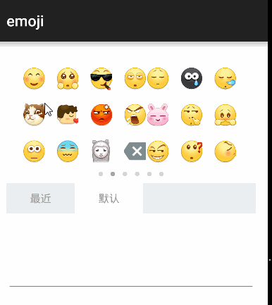
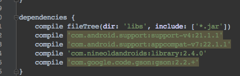

# yykEmoji
andorid表情




Build方法一（复杂）:


在Andorid Studio中右击你的项目—>Open Module Settings.

点击左上角的➕号，并在弹出来的页面中选择import gradle Project, 选择我们的library,并可以命名为你需要的module名字，例如”:emoji”（注意冒号）

自动回到了刚刚有➕号的页面，看到左边一栏中的“Modules”一栏中多了我们刚刚导入并命名的Module，把你的app的Compile Sdk Version 和 Build Tools Version 分别设置为
API 21: Android 5.0(Lollipop) 和 21.1.0 (与emoji这个module一样) 点击OK.

该Library引用了如下库，如果你的app也引用了如下库，请把它们的版本号改成一样（同时注意你的targetSdkVersion），否则会报错。



(确保你app里的setting.gradle中含有该Module，之后在app中的build.gradle中的dependencies中加入compile project(‘:emoji’)(emoji换成你之前命名的module名字))之后就可以reBuild一下项目啦，如果遇到EmojiUtil类在Build时报错，在报错的时候导入一下包就好了。


Build方法二（简单粗暴）：


`compile 'com.tb.emoji:yykEmoji:1.0.0'`


代码中的使用：
```
FaceFragment faceFragment = FaceFragment.Instance();
getSupportFragmentManager().beginTransaction().add(R.id.Container,faceFragment).commit();
```
注意让你的Activity实现(Fragment中set接口)`FaceFragment.OnEmojiClickListener`来处理emoji的点击事件


# Changelog

## 1.1.0
- 增加英文表情编码
- 增加将转化成的表情提取出来的方法（EmojiUtil.handlerTextToEmojiSpannable()）让用户可以自定义
- 用法：compile 'com.tb.emoji:yykEmoji:1.1.0'